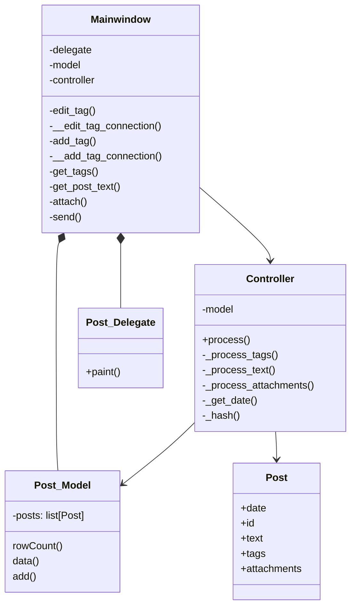

Python project for creating mini diary entries, sorted by day. Personally inspired by the way I like to write diaries.

```mermaid
classDiagram
    class Post {
        +date
        +id
        +text
        +tags
        +attachments
    }

    class Post_Model {
        -posts: list[Post]
        rowCount()
        data()
        add()
    }

    class Mainwindow {
        -delegate
        -model
        -controller
        -edit_tag()
        -__edit_tag_connection()
        -add_tag()
        -__add_tag_connection()
        -get_tags()
        -get_post_text()
        -attach()
        -send()
    }

    class Controller {
        -model
        +process()
        -_process_tags()
        -_process_text()
        -_process_attachments()
        -_get_date()
        -_hash()
    }

    class Post_Delegate {
        +paint()
    }

    Mainwindow *-- Post_Model
    Mainwindow *-- Post_Delegate
    Mainwindow --> Controller
    Controller --> Post
    Controller --> Post_Model
```

